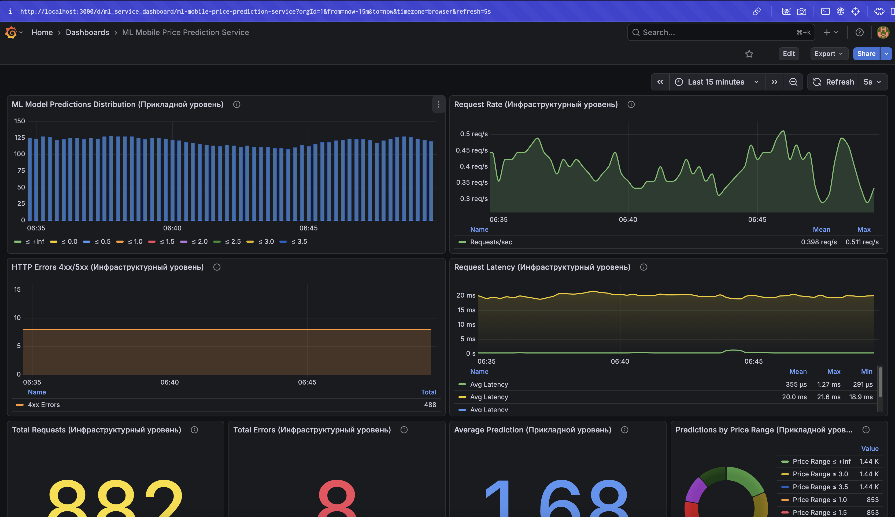
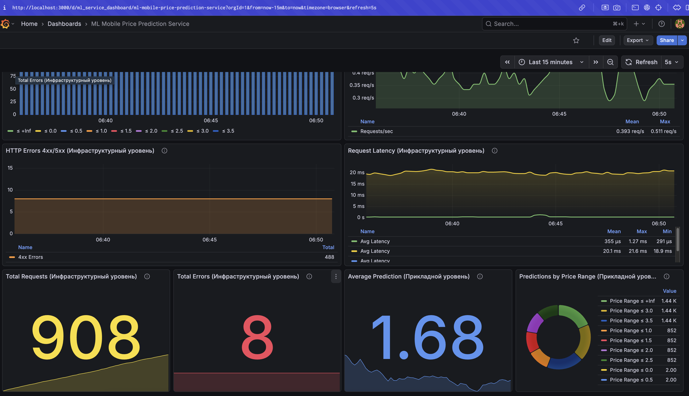

# Проект классификации ценового диапазона мобильных телефонов

## Описание проекта
Полноценный ML-проект с микросервисной архитектурой для предсказания ценового диапазона мобильных телефонов на основе их характеристик.

### Используемые технологии и библиотеки:
- **Machine Learning**: scikit-learn, pandas, numpy
- **Эксперименты и трекинг**: MLflow
- **API**: FastAPI, Uvicorn
- **Контейнеризация**: Docker, Docker Compose
- **Мониторинг**: Prometheus, Grafana
- **Визуализация**: matplotlib, seaborn, plotly
- **Оптимизация**: Optuna (гиперпараметры)

Проект включает в себя:
- Разведочный анализ данных (EDA)
- Обучение и оптимизацию моделей ML
- Отслеживание экспериментов через MLflow
- Развертывание модели в виде REST API
- Мониторинг работы сервиса в реальном времени
- Автоматическое тестирование через генерацию запросов

---

## Структура проекта
```
├── data/                      # Датасеты
│   ├── clean_dataset.pkl
│   ├── new_clean_dataset.pkl
│   ├── test.csv
│   └── train.csv
├── eda/                       # Разведочный анализ данных
│   ├── eda_revised.ipynb
│   ├── eda.ipynb
│   └── graph/
├── research/                  # Эксперименты с моделями
│   └── research.ipynb
├── services/                  # Микросервисы
│   ├── ml_service/           # REST API для предсказаний
│   │   ├── main.py
│   │   ├── api_handler.py
│   │   ├── Dockerfile
│   │   └── requirements.txt
│   ├── requests/             # Сервис генерации тестовых запросов
│   │   ├── send_requests.py
│   │   ├── Dockerfile
│   │   └── requirements.txt
│   ├── models/               # ML модели
│   │   ├── model.pkl
│   │   └── get_model.py
│   ├── prometheus/           # Конфигурация мониторинга
│   │   └── prometheus.yml
│   ├── grafana/              # Дашборды и конфигурация
│   │   ├── ml_service_dashboard.json
│   │   ├── DASHBOARD_IMPORT.md
│   │   └── README_DASHBOARD_SECTION.md
│   └── compose.yml           # Docker Compose конфигурация
├── mlflow/                    # MLflow конфигурация
│   └── mlflow.sh
├── mlartifacts/              # Артефакты MLflow
├── mlruns.db                 # База данных экспериментов
├── README.md
└── requirements.txt          # Зависимости Python
```

## Запуск проекта
Чтобы развернуть проект на другой машине, выполните следующие шаги:

1. **Клонировать репозиторий:**
```textmate
git clone https://github.com/buttonCreator/IIS.git
cd IIS
```

2. **Создать и активировать виртуальное окружение:**
```textmate
python3 -m venv venv
source venv/bin/activate
```

3. **Установить зависимости:**
```textmate
pip install -r requirements.txt
```
4. **Загрузить датасет:**
https://www.kaggle.com/datasets/iabhishekofficial/mobile-price-classification/code
Скопируйте исходный `test.csv` и `train.csv` в папку `data/`.

6. **Запустить EDA:**  
Открыть блокнот:
```textmate
jupyter notebook eda/eda.ipynb
```
## Результаты EDA

В ходе проведения разведочного анализа данных были выполнены следующие шаги:

1. **Загрузка и знакомство с данными**  
   - Определены числовые и категориальные признаки.  
   - Проверены типы данных 

2. **Очистка данных**  
   - Проверка датасет на адекватность данных.
   - Удалены дубликаты и невалидные значения.  
   - Обработаны пропущенные значения.

3. **Анализ признаков**  
   - Построены графики распределения фичей, матрица корреляции, распределение таргета относительно возраста, интерактивный график целевой переменной в осях холестерина и макимальной частоты биения сердца.  
   - Выявлены зависимости между признаками и целевой переменной.  
   - Определены признаки, которые могут сильно влиять на результат модели.   

4. **Сохранение данных**  
   - Финальный очищенный датасет сохранён в формате `.pkl` для корректного хранения типов данных.  


***
### Выводы которые были получены в ходе EDA

- Признак `touch_screen` — бинарный признак с сильным дисбалансом: большинство телефонов имеют сенсорный экран (значение 1.0), небольшая часть без него (значение 0.0)

- Признак `sc_w` (ширина экрана) — имеет экспоненциальное распределение с максимальным числом наблюдений в диапазоне 0-2.5, плавно убывая к большим значениям

- Признак `wifi` — бинарный признак с выраженным дисбалансом: подавляющее большинство устройств поддерживает Wi-Fi (значение 1.0), минимальное количество без поддержки (значение 0.0)

- Признак `ram` (оперативная память) — имеет распределение, близкое к нормальному, с пиком около 2500 МБ, равномерно распределённые значения от 500 до 4000 МБ

- Признак `clock_speed` (тактовая частота) — сильно смещён влево, большинство значений сконцентрировано в диапазоне 0.5-1.0 ГГц, небольшой пик на отметке 3.0 ГГц

- Признак `price_range` (ценовая категория) — равномерно распределён по четырём классам (0, 1, 2, 3), что оптимально для обучения модели классификации

- Признак `sc_h` (высота экрана) — распределение с двумя пиками: основной в области 5-7 см и второй в области 17 см, указывающий на разные типы устройств

- Признак `px_height` (высота в пикселях) — экспоненциальное распределение с максимумом около 200 пикселей, плавно убывающее к значениям выше 1500 пикселей

- Признак `dual_sim` — бинарный признак с равномерным распределением между устройствами с поддержкой двух SIM-карт (значение 1.0) и без неё (значение 0.0)

- Признак `four_g` — бинарный признак с выраженным дисбалансом: большинство устройств поддерживает 4G (значение 1.0), меньшинство без поддержки (значение 0.0)

- Признак `fc` (фронтальная камера) — экспоненциальное распределение с пиком в области низких значений мегапикселей, плавно убывающее к высоким разрешениям

- Признак `m_dep` (глубина корпуса) — относительно равномерное распределение с небольшими флуктуациями, основная масса значений в диапазоне 0.1-1.0 см

- Признак `three_g` — бинарный признак с сильным дисбалансом в пользу устройств с поддержкой 3G (значение 1.0), очень малая доля без поддержки (значение 0.0)

- Признак `blue` (Bluetooth) — бинарный признак с равномерным распределением между устройствами с Bluetooth (значение 1.0) и без него (значение 0.0)

- Признак `talk_time` (время разговора) — относительно равномерное распределение с небольшими вариациями по всему диапазону значений

- Признак `battery_power` (ёмкость батареи) — распределение близко к нормальному с пиком в области 600 мАч, плавно убывающее к крайним значениям

- Признак `mobile_wt` (вес устройства) — нормальное распределение с пиком около 140 грамм, равномерно распределённые значения от 80 до 200 грамм

- Признак `px_width` (ширина в пикселях) — относительно равномерное распределение с небольшим пиком в середине диапазона, значения от 500 до 2000 пикселей

- Признак `pc` (основная камера) — экспоненциальное распределение с максимумом в области низких значений мегапикселей, резко убывающее к высоким разрешениям

- Признак `int_memory` (внутренняя память) — близкое к нормальному распределение с пиком около 30 ГБ, плавно убывающее к крайним значениям

- Признак `n_cores` (количество ядер процессора) — относительно равномерное распределение по дискретным значениям от 1 до 8 ядер с небольшим пиком на 4 ядрах

- Boxplot RAM по ценовой категории показывает четкую положительную зависимость: объём оперативной памяти последовательно увеличивается с повышением ценовой категории — от медианного значения около 750 МБ для бюджетных телефонов (price_range 0) до 3500 МБ для премиальных устройств (price_range 3), что подтверждает RAM как один из основных факторов ценообразования мобильных устройств.

***

### Основные выводы
По графикам выявлены следующие закономерности, полезные для решения задачи классификации ценового диапазона мобильных телефонов:

- Признак `ram` (оперативная память) демонстрирует четкую положительную корреляцию с ценовой категорией — от 750 МБ для бюджетных до 3500 МБ для премиальных устройств, что делает его ключевым предиктором.

- Бинарные признаки `touch_screen`, `wifi`, `four_g`, `three_g` имеют сильный дисбаланс в сторону современных технологий, что отражает текущие рыночные стандарты и поможет при создании категориальных признаков.

- Признак `battery_power` (ёмкость батареи) показывает нормальное распределение с пиком около 1200-1400 мАч, что важно учитывать при анализе энергопотребления устройств разных ценовых категорий.

- Характеристики экрана (`px_height`, `px_width`, `sc_h`) имеют экспоненциальное распределение, указывающее на преобладание устройств с базовыми параметрами дисплея в выборке.

- Признак `clock_speed` (тактовая частота) сильно смещён влево с концентрацией в диапазоне 0.5-1.0 ГГц, что может служить индикатором производительности процессора.

- Камеры (`fc`, `pc`) показывают экспоненциальное распределение с преобладанием низких разрешений, что характерно для массового сегмента рынка.

- Целевая переменная `price_range` равномерно распределена по четырём классам, что оптимально для обучения модели классификации без дополнительной балансировки.

- Признаки веса (`mobile_wt`) и внутренней памяти (`int_memory`) имеют близкие к нормальному распределения, что упростит их использование в линейных моделях.

## Запуск mlflow-server

Запуск mlflow-server:
```shell
   sh mlflow/mlflow.sh
```

## Проведенные эксперименты

В ходе исследования были последовательно протестированы следующие подходы:

- **Baseline-модель** - базовая модель без дополнительных преобразований признаков
- **Модель с расширенным набором признаков** - с использованием PolynomialFeatures, QuantileTransformer и SplineTransformer
- **Модель с отбором признаков** - с применением Sequential Feature Selection для выбора наиболее значимых признаков

Наилучшие результаты показала модель с Sequential Feature Selection, которая была дополнительно оптимизирована с помощью фреймворка Optuna.

## Анализ результатов

### Сравнительная эффективность моделей
В результате подбора гиперпараметров с использованием Sequential Feature Selection были определены следующие оптимальные значения:
- **MAE**: 0.16
- **MSE**: 0.09
- **R2**: 0.94

## Оптимальная конфигурация модели
В результате подбора гиперпараметров с использованием Optuna были определены следующие оптимальные значения:
- **max_depth**: 18
- **n_estimators**: 67
- **max_features**: 0.89
- **min_samples_split**: 2
- **min_samples_leaf**: 1

## Финальные метрики качества
После применения подобранных гиперпараметров достигнуты следующие показатели:
- **MAE**: 0.063
- **MSE**: 0.014
- **R2**: 0.988

Идентификатор Production-модели в MLflow: `adf10749f4b14844b47b31efe72d1370`

# Создание сервиса

### 1. Основной API-сервер с FastAPI

**Реализованные эндпоинты:**
- **GET /** - возвращает сообщение `{'Hello': 'world'}` для проверки работоспособности <br/>
- **POST /api/prediction** - принимает характеристики мобильного телефона и возвращает предсказанный ценовой диапазон <br/>
- **GET /metrics** - возвращает метрики Prometheus для мониторинга <br/>
- **GET /docs** - интерактивная Swagger UI документация <br/>

### 2. Обработчик предсказаний модели

**Класс FastAPIHandler:**
- При создании экземпляра класса загружает модель из файла `model.pkl` <br/>
- Логирует успешность загрузки или ошибки <br/>
- Метод `predict` принимает словарь с признаками телефона, преобразует его в pandas.DataFrame, подает на вход модели и возвращает предсказанный ценовой диапазон <br/>

### 3. Dockerfile для контейнеризации сервиса

```dockerfile
FROM python:3.9-slim
COPY . /ml_service
RUN mkdir -p /models
WORKDIR /ml_service
RUN pip install --no-cache-dir -r requirements.txt
EXPOSE 8000
CMD ["uvicorn", "main:app", "--host", "0.0.0.0", "--port", "8000"]
```

**Особенности:**
- Копирование всех файлов приложения в контейнер <br/>
- Установка зависимостей из `requirements.txt` <br/>
- Обеспечение возможности подключения модели через монтируемую папку (`/models`) <br/>
- Запуск приложения с помощью uvicorn <br/>

### 4. Зависимости сервиса (requirements.txt)

```txt
fastapi
uvicorn
pandas
scikit-learn==1.6.1
pickle4
cloudpickle
prometheus-client==0.19.0
```

### 5. Интеграция с MLflow

**Назначение:**
- Загружаем модель из MLflow с помощью скрипта `services/models/get_model.py` <br/>
- Сохраняет модель в файл `model.pkl` для дальнейшего использования в контейнере <br/>

### 6. Проверка работоспособности сервиса

**Пример тестового запроса:**
```python
{
    "battery_power": 1403,
    "blue": 0,
    "clock_speed": 2.7,
    "dual_sim": 0,
    "fc": 2,
    "four_g": 1,
    "int_memory": 26,
    "m_dep": 0.1,
    "mobile_wt": 164,
    "n_cores": 5,
    "pc": 10,
    "px_height": 1200,
    "px_width": 1251,
    "ram": 3371,
    "sc_h": 13,
    "sc_w": 9,
    "talk_time": 9,
    "three_g": 1,
    "touch_screen": 0,
    "wifi": 1,
    "battery_efficiency": 8.554878,
    "screen_size": 15.811388
}
```

**Ожидаемый ответ:**
```python
{
    "item_id": 123,
    "price": 2.85
}
```

Сервис возвращает значение `price`, что позволяет определить ценовой диапазон мобильного телефона (0-3).

## Мониторинг

### 1. Prometheus

**Настройка:**
- Веб-интерфейс доступен по адресу: http://localhost:9090 <br/>
- Конфигурационный файл: `services/prometheus/prometheus.yml` <br/>
- Полученные скриншоты и файл конфигурации размещены в директории: `services/prometheus/` <br/>

**Ключевые метрики:**

**Гистограмма предсказаний модели**


**Частота (rate) запросов к основному сервису в минуту**


### 2. Grafana Dashboard

**Настройка:**
- Создан дашборд для мониторинга метрик, который сохранён в директории: `services/grafana/` <br/>
- Веб-интерфейс Grafana доступен по адресу: http://localhost:3000 <br/>
- В качестве источника данных (data source) используется Prometheus <br/>
- Готовый дашборд для импорта: `services/grafana/ml_service_dashboard.json` <br/>




**Панели дашборда:**

**Панель 1 - ML Model Predictions Distribution**
- **Визуализация**: Гистограмма распределения предсказаний модели по ценовым диапазонам (0-3)
- **Метрики**: `ml_model_predictions_bucket`
- **Назначение**: Анализ распределения результатов работы модели, выявление bias в предсказаниях
- **Уровень**: Прикладной

**Панель 2 - Request Rate**
- **Визуализация**: Частота HTTP-запросов в секунду к сервису предсказаний
- **Метрики**: `rate(ml_service_requests_total[1m])`
- **Назначение**: Мониторинг нагрузки на API и частоты использования сервиса
- **Уровень**: Инфраструктурный

**Панель 3 - HTTP Errors 4xx/5xx**
- **Визуализация**: Частота ошибок HTTP с кодами 4xx и 5xx
- **Метрики**: `ml_service_errors_total{status_code="500"}`, `ml_service_errors_total{status_code=~"4.."}`
- **Назначение**: Контроль стабильности работы API и выявление проблем
- **Уровень**: Инфраструктурный

**Панель 4 - Request Latency**
- **Визуализация**: Среднее время ответа сервиса на запросы
- **Метрики**: `rate(http_request_duration_seconds_sum[1m]) / rate(http_request_duration_seconds_count[1m])`
- **Назначение**: Мониторинг производительности, выявление деградации
- **Уровень**: Инфраструктурный

**Панель 5 - Total Requests**
- **Визуализация**: Общее количество выполненных запросов с момента запуска
- **Метрики**: `ml_service_requests_total`
- **Назначение**: Отслеживание объёма работы сервиса
- **Уровень**: Инфраструктурный

**Панель 6 - Total Errors**
- **Визуализация**: Суммарное количество всех ошибок
- **Метрики**: `sum(ml_service_errors_total)`
- **Назначение**: Быстрая оценка надежности сервиса
- **Уровень**: Инфраструктурный

**Панель 7 - Average Prediction**
- **Визуализация**: Среднее значение предсказаний модели
- **Метрики**: `ml_model_predictions_sum / ml_model_predictions_count`
- **Назначение**: Отслеживание тренда предсказаний, детектирование data drift
- **Уровень**: Прикладной

**Панель 8 - Predictions by Price Range**
- **Визуализация**: Pie chart с распределением предсказаний по ценовым категориям
- **Метрики**: `sum by(le) (increase(ml_model_predictions_bucket[1h]))`
- **Назначение**: Визуализация популярности каждого ценового диапазона
- **Уровень**: Прикладной

## Запуск системы

### 1. Команды для запуска

```bash
# Сборка образа ML сервиса
docker compose build ml_service

# Запуск compose-проекта
cd services
docker compose up -d
```

### 2. Доступные сервисы после запуска

| Сервис | URL | Описание |
|--------|-----|----------|
| ML Service | http://localhost:8000 | REST API для предсказания ценового диапазона |
| Swagger UI | http://localhost:8000/docs | Интерактивная документация API |
| Prometheus | http://localhost:9090 | Сбор и хранение метрик |
| Grafana | http://localhost:3000 | Визуализация метрик и дашборды |

---

### 3. Дашборды Grafana

| Панель | Метрики | Уровень | Назначение |
|--------|---------|---------|------------|
| ML Model Predictions Distribution | `ml_model_predictions_bucket` | Прикладной | Распределение предсказаний |
| Request Rate | `ml_service_requests_total` | Инфраструктурный | Нагрузка на API |
| HTTP Errors 4xx/5xx | `ml_service_errors_total` | Инфраструктурный | Стабильность сервиса |
| Request Latency | `http_request_duration_seconds` | Инфраструктурный | Производительность |
| Total Requests | `ml_service_requests_total` | Инфраструктурный | Объём работы сервиса |
| Total Errors | `ml_service_errors_total` | Инфраструктурный | Надежность сервиса |
| Average Prediction | `ml_model_predictions_sum/count` | Прикладной | Тренд предсказаний |
| Predictions by Price Range | `ml_model_predictions_bucket` | Прикладной | Распределение по категориям |
